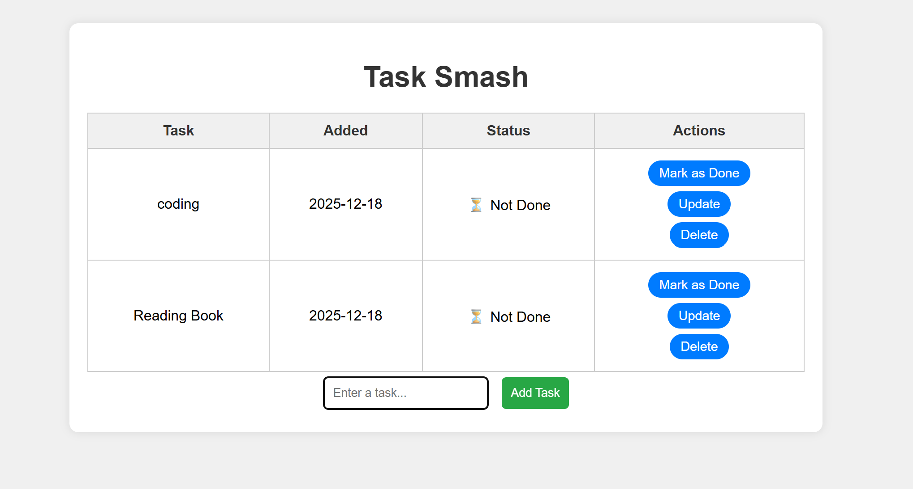
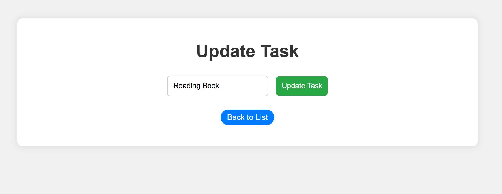
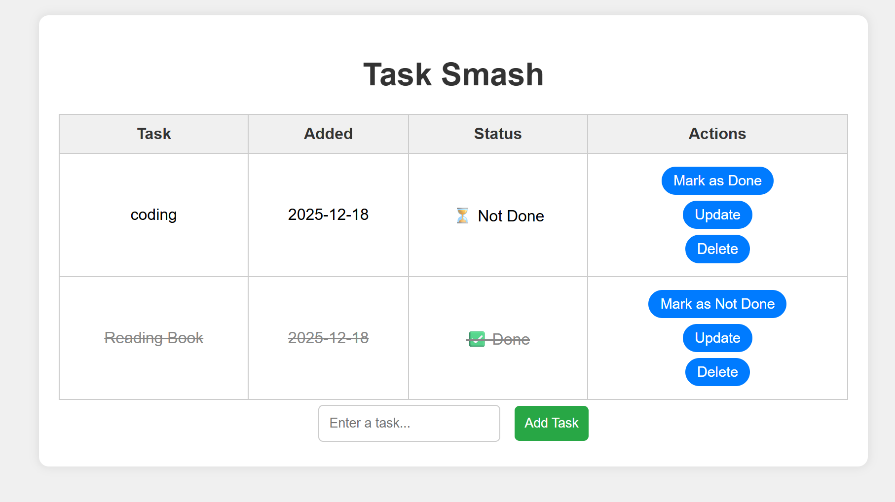

#  To-Do List Web Application (Flask CRUD App)

A simple and user-friendly **To-Do List web application** built using **Flask** that allows users to manage daily tasks efficiently using **CRUD operations**.

## Project Overview

This project helps users:
- Add tasks
- View all tasks
- Update existing tasks
- Delete completed or unwanted tasks  

It demonstrates the **core concepts of backend development**, database interaction, and templating using Flask.

## 🎯 Objectives

- Understand Flask application structure  
- Implement CRUD operations  
- Learn database interaction using SQLAlchemy  
- Build dynamic web pages using Jinja2  
- Gain hands-on experience with full-stack basics  

## 🛠️ Tech Stack

| Layer | Technology |
|-----|-----------|
| Frontend | HTML, CSS |
| Backend | Python (Flask) |
| Database | SQLite |
| ORM | SQLAlchemy |
| Version Control | Git & GitHub |

## ✨ Features

- Add new tasks  
- View all tasks in a table  
- Update existing tasks  
- Delete tasks  
- Auto-store task creation date  
- Clean and simple UI  

## 🧠 Core Concepts Used

- Flask routing  
- SQLAlchemy ORM  
- CRUD operations  
- Jinja2 templating  
- Form handling  
- Basic error handling  

## 🖥️ Application Pages

| Page | Description |
|----|------------|
| `/` | Home page – Add & view tasks |
| `/update/<id>` | Update existing task |
| `/delete/<id>` | Delete task |

## 🧩 Database Design

### Table: `Todo`

| Field | Description |
|----|-----------|
| id | Primary key |
| content | Task description |
| completed | Task status |
| date_created | Timestamp |

## 🎨 UI Design

- Simple and clean layout  
- Table-based task display  
- Easy navigation  
- Beginner-friendly interface  

---

## 📸 Screenshots

### 🏠 Home Page

### ✏️ Update Task

### ✏️ Done Task

